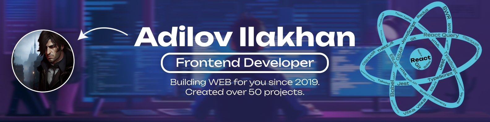

# 💫 About Me:

Frontend Developer with 5 years of experience, I have worked on 50+ projects for various companies. I’ve collaborated with designers, backend developers and cross-functional teams to deliver projects that meet business needs. Solved complex technical problems and improved product quality. I work in a fast-paced environment and am always eager to learn new technologies to stay on top of the niche. I can code like a machine, but I promise, I’m all human, when it comes to creativity and problem solving.

###

# 🌐 Socials:
 
 
 

###

# 💻 Tech Stack:

---
